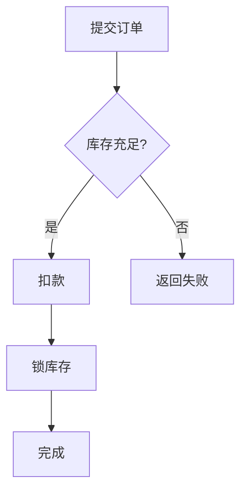

# SOP 03 - Dynamic Views（场景流程与时序图）

## Goal

用 `dynamic view` 表达「一次具体交互的时间顺序」，支持时序图变体、并发块、步骤备注和视图下钻；**如实告知版本差异与不可用特性**，不得编造未验证语法。

## When Required

用户要求场景流程图、时序图、use-case 走法、并发分支，或需要在视图中分步下钻时。

## 版本实测结论（likec4 1.58.0）

> **这是本文件最重要的部分。官方文档描述最新版本特性，当前锁定版本可能不支持。**

| 特性 | 1.58.0 实测 | 说明 |
| --- | --- | --- |
| `dynamic view`（diagram 变体） | 可用 | 场景流程图 |
| `variant sequence` | 可用 | 经典时序图渲染 |
| `parallel` / `par` | 可用 | 并发，**不可嵌套** |
| `opt` / `loop` / `break` | **不可用** | 解析失败 |
| `alt` / `when` / `else` | **不可用** | 解析失败 |
| `try` / `catch` / `finally` | **不可用** | 解析失败 |
| `notes`（步骤备注） | 可用 | 支持 Markdown |
| `navigateTo`（下钻） | 可用 | 目标须具名 |
| `include`（固定参与者顺序） | 可用 | sequence 变体可用 |
| `include` + `style`（压暗） | 可用 | 保留上下文用 |
| 连续步骤 `A -> B -> C` | 可用 | 自动识别回退 |
| 视图文件夹 `views 'Label'` | **不可用** | 解析失败，勿使用 |

**处理规则**：

1. 用户要求条件分支、循环、异常处理时，**先确认目标版本**。
2. 若当前版本不支持，明确告知「本版本不支持，改用 Mermaid `stateDiagram-v2` / `flowchart` 或 PlantUML」，并说明升级 LikeC4 可能获得该能力。
3. 不要把官方文档中的 `opt`/`loop`/`alt`/`try` 写进代码——它们在 1.58.0 会直接让 `validate` 失败。
4. 升级版本后必须重新实测，并更新本表。

## 基础语法

`dynamic view` 中定义的元素和关系只存在于该视图内，不污染 `model`。

```c4
views {
  dynamic view checkout {
    title 'Checkout Flow'

    user -> platform.web 'submits order'
    platform.web -> platform.api 'POST /checkout'
    platform.api -> platform.db 'writes order'
    platform.api -> platform.jobs 'enqueue followup'
  }
}
```

要点：

- 不写标题的步骤，标题从 `model` 对应关系推导。
- 允许自调用 `api -> api 'process'`。
- 反向步骤 `web <- api 'returns'`。

### 连续步骤

```c4
dynamic view chained {
  title 'Continuous Steps'
  user -> platform.web -> platform.api
}
```

`A -> B -> C -> A` 等价于 `A -> B; B -> C; C <- A`，自动识别回退方向。

## sequence 变体（时序图）

```c4
dynamic view asyncJobSequence {
  variant sequence
  title 'Async Job Lifecycle'

  platform.api -> platform.jobs 'enqueue'
  platform.worker -> platform.jobs 'dequeue'
  platform.worker -> platform.db 'update'
}
```

**硬限制：sequence 变体只支持叶子元素之间的连接**，即不含任何子元素的元素。连接有子元素的容器不受支持。若目标是含组件的 `platform`，必须改连叶子元素或改用 diagram 变体。

无生命线（lifeline）与激活棒（activation bar）渲染。

## 并发

```c4
dynamic view seqParallel {
  variant sequence
  title 'Concurrent Reads'

  platform.api -> platform.db 'load profile'
  parallel {
    platform.api -> platform.jobs 'peek queue'
    platform.api -> platform.db 'load settings'
  }
}
```

- 别名 `par` 等价于 `parallel`。
- **`parallel` 不可嵌套**（嵌套直接报错），1.58.0 实测确认。
- diagram 与 sequence 两种变体下均可用。

## 固定参与者顺序

默认顺序由步骤出现顺序推导。需固定时用 `include`：

```c4
dynamic view seqOrdered {
  variant sequence
  title 'Actor Order'

  platform.api -> platform.jobs 'enqueue'
  platform.worker -> platform.db 'update'
  include platform.worker, platform.api, platform.db
}
```

`include` 只固定部分顺序，其余按步骤推导。

## 步骤备注

```c4
dynamic view withNotes {
  title 'Notes Example'
  platform.api -> platform.jobs 'enqueue' {
    notes '''
      **Entry point**: request handler
      - bounded retries
    '''
  }
}
```

## 视图下钻

```c4
dynamic view drill {
  title 'Drill Down'
  platform.web -> platform.api {
    navigateTo asyncJobSequence
  }
}
```

目标必须是**具名**视图。

## 保留未参与元素

```c4
dynamic view a {
  title 'A'
  platform.api -> platform.db 'reads'
  include platform          // 引入但不画连线
  style platform {
    color muted
    opacity 0%
  }
}
```

## 与 use case 的关系（必须向用户澄清）

官方定位是「描述特定 use-case 或场景」，但它**不是 UML 用例图**：

| 维度 | UML 用例图 | LikeC4 dynamic view |
| --- | --- | --- |
| 表达目标 | 参与者与目标（想做什么） | 一次交互的时间顺序（怎么走） |
| 元素 | actor + use case 椭圆 | 元素 + 消息步骤 |
| 关系 | include / extend 泛化 | 仅步骤连线 |
| 回答的问题 | 系统为谁提供哪些能力 | 这条链路依次经过哪些环节 |

用户说「用例图」时必须说明差异，并按 `references/00-diagram-routing.md` 判断是否改走 PlantUML。

## 条件分支的替代方案（本版本不可用时）

若用户确实需要条件分支、循环或异常处理，本版本用 Mermaid 更实际：



这类图应明确标注为**表达产物（轨道二）**，不是架构模型真源。

## 常见失败模式（实测确认）

| 现象 | 根因 | 修正 |
| --- | --- | --- |
| `Could not resolve reference to Referenceable named 'try'` | 本版本无 `try` | 改 Mermaid flowchart |
| 期望 `}` 但遇到 `catch` / `else` | 本版本无异常/分支块 | 同上 |
| sequence 视图渲染异常 | 连接了非叶子元素 | 改连叶子元素或用 diagram 变体 |
| 嵌套 `parallel` 报错 | 并发块不可嵌套 | 拍平成单层 |
| `Line 1: Expecting } but found views` | 用了视图文件夹分组 | 拆成多个文件，用文件名区分 |
| `Duplicate view` | 视图名重复 | 改名 |
