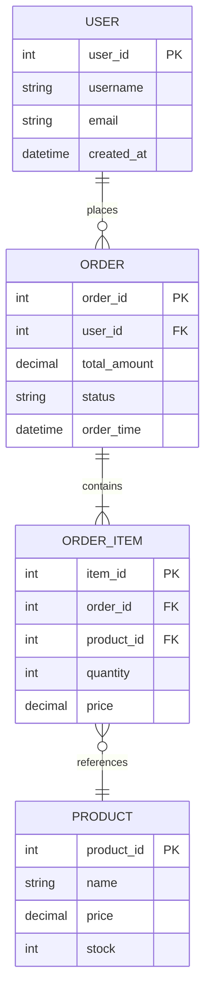

# E-R 图经典案例：电商系统核心实体关系

```mermaid
erDiagram
    USER ||--o{ ORDER : places
    USER {
        int user_id PK
        string username
        string email
        datetime created_at
    }
    
    ORDER ||--|{ ORDER_ITEM : contains
    ORDER {
        int order_id PK
        int user_id FK
        decimal total_amount
        string status
        datetime order_time
    }
    
    ORDER_ITEM }o--|| PRODUCT : references
    ORDER_ITEM {
        int item_id PK
        int order_id FK
        int product_id FK
        int quantity
        decimal price
    }
    
    PRODUCT {
        int product_id PK
        string name
        decimal price
        int stock
    }
```

**说明**：展示用户、订单、订单项、商品的关系，包含主键（PK）、外键（FK）标注，体现一对多、多对一关系。
