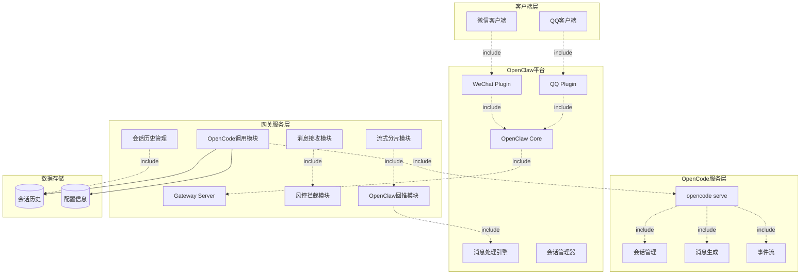

# 组件图经典案例：OpenCode WeChat/QQ Gateway 系统架构

**说明**：
- **客户端层**：微信和QQ客户端通过各自的OpenClaw插件接入
- **OpenClaw平台**：核心的消息处理和会话管理功能
- **网关服务层**：主要包含消息接收、风控、会话管理、OpenCode调用和流式分片等核心模块
- **OpenCode服务层**：提供会话管理和AI生成能力
- **数据存储**：存储会话历史和配置信息

**关系类型**：
- `-.include.- >`：包含关系，表示组件间的调用依赖
- `-->`：关联关系，表示数据流向或调用方向
