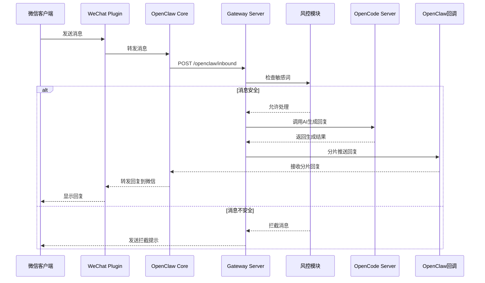

# 时序图经典案例：OpenCode Gateway 消息处理流程

**说明**：
- **正常流程**：消息经风控检查后，由OpenCode生成回复，通过分片方式回推给用户
- **风控流程**：检测到敏感内容时直接拦截并返回提示
- **分片机制**：将长回复按字符切分，模拟流式效果

**关键组件**：
- 微信插件负责与客户端通信
- 网关服务器处理核心业务逻辑
- OpenCode服务器提供AI能力
- 风控模块确保消息安全性
