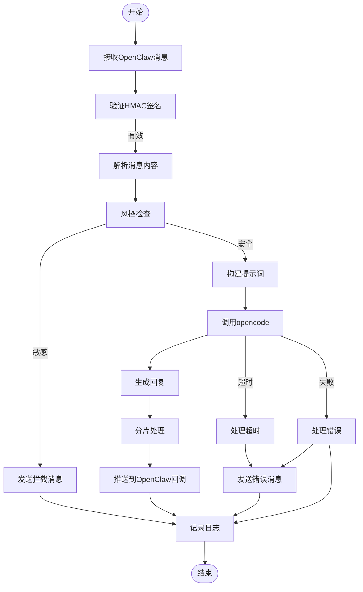

# 流程图经典案例：OpenCode Gateway 消息处理逻辑

**说明**：
- **正常流程**：消息接收→签名验证→风控检查→AI生成→分片推送
- **风控拦截**：检测到敏感内容时直接返回拦截提示
- **异常处理**：包含超时和调用失败的错误处理机制
- **日志记录**：所有关键操作都记录日志便于追踪

**流程特点**：
- 采用模块化设计，每个步骤职责清晰
- 完善的异常处理和日志机制
- 支持实时流式回复效果
