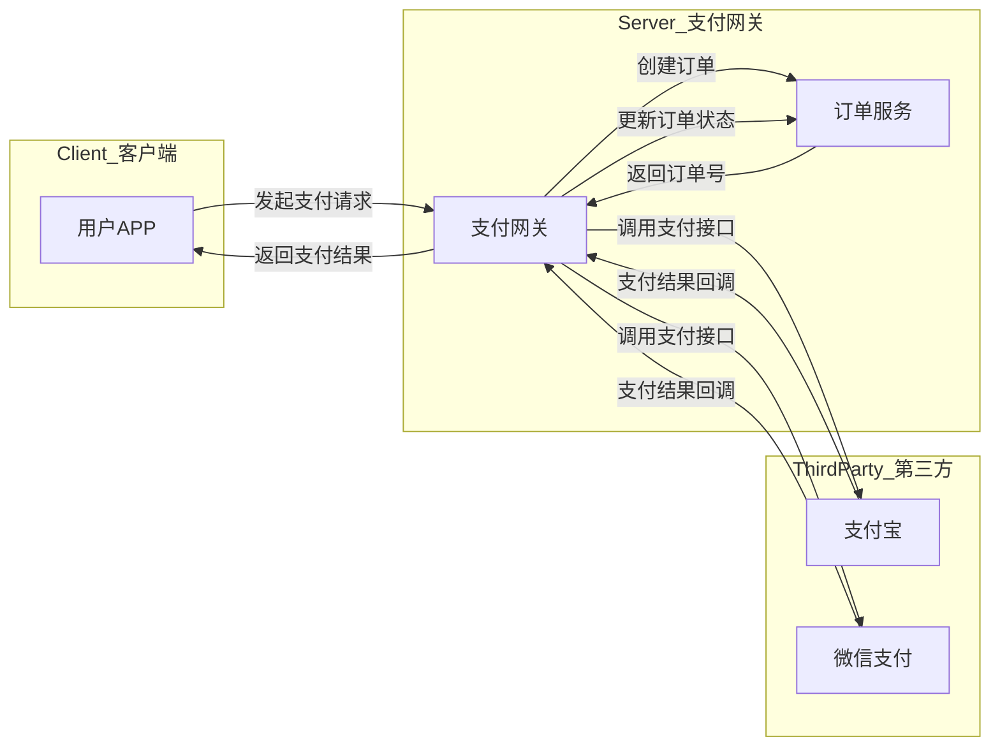

# DFD 图经典案例：支付系统数据流

```mermaid
graph LR
    subgraph Client_客户端
        UserApp[用户APP]
    end
    
    subgraph Server_支付网关
        PayGateway[支付网关]
        OrderService[订单服务]
    end
    
    subgraph ThirdParty_第三方
        Alipay[支付宝]
        WeChat[微信支付]
    end
    
    UserApp -->|发起支付请求| PayGateway
    PayGateway -->|创建订单| OrderService
    OrderService -->|返回订单号| PayGateway
    PayGateway -->|调用支付接口| Alipay
    PayGateway -->|调用支付接口| WeChat
    Alipay -->|支付结果回调| PayGateway
    WeChat -->|支付结果回调| PayGateway
    PayGateway -->|更新订单状态| OrderService
    PayGateway -->|返回支付结果| UserApp
```

**说明**：使用 subgraph 区分客户端、服务端、第三方，清晰展示数据流向和接口边界。
