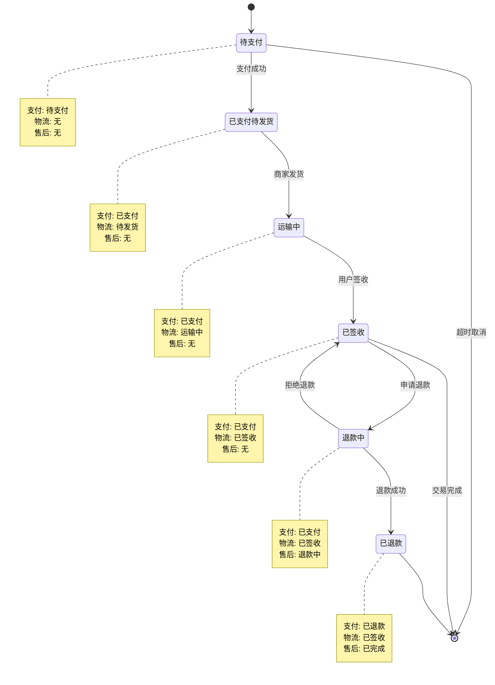

# 状态图经典案例：订单多属性状态生命周期

```mermaid
stateDiagram-v2
    [*] --> S1
    
    S1: 待支付
    note right of S1
        支付: 待支付
        物流: 无
        售后: 无
    end note
    
    S2: 已支付待发货
    note right of S2
        支付: 已支付
        物流: 待发货
        售后: 无
    end note
    
    S3: 运输中
    note right of S3
        支付: 已支付
        物流: 运输中
        售后: 无
    end note
    
    S4: 已签收
    note right of S4
        支付: 已支付
        物流: 已签收
        售后: 无
    end note
    
    S5: 退款中
    note right of S5
        支付: 已支付
        物流: 已签收
        售后: 退款中
    end note
    
    S6: 已退款
    note right of S6
        支付: 已退款
        物流: 已签收
        售后: 已完成
    end note
    
    S1 --> S2: 支付成功
    S1 --> [*]: 超时取消
    S2 --> S3: 商家发货
    S3 --> S4: 用户签收
    S4 --> S5: 申请退款
    S4 --> [*]: 交易完成
    S5 --> S6: 退款成功
    S5 --> S4: 拒绝退款
    S6 --> [*]
```

**说明**：使用 note right of 在状态外部标注多属性状态，展示订单实体的完整生命周期。
