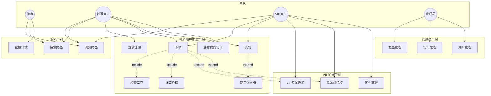

# 用例图经典案例：电商系统用户角色权限

```mermaid
graph TB
    subgraph 角色
        Guest((游客))
        User((普通用户))
        VIP((VIP用户))
        Admin((管理员))
    end
    
    subgraph 游客用例
        Browse[浏览商品]
        Search[搜索商品]
        ViewDetail[查看详情]
    end
    
    subgraph 普通用户扩展用例
        Login[登录注册]
        PlaceOrder[下单]
        Pay[支付]
        ViewMyOrder[查看我的订单]
        
        PlaceOrder -.include.-> CheckStock[检查库存]
        PlaceOrder -.include.-> CalcPrice[计算价格]
        Pay -.extend.-> UseCoupon[使用优惠券]
    end
    
    subgraph VIP扩展用例
        VIPDiscount[VIP专属折扣]
        FreeShipping[免运费特权]
        PriorityService[优先客服]
        
        PlaceOrder -.extend.-> VIPDiscount
        PlaceOrder -.extend.-> FreeShipping
    end
    
    subgraph 管理员用例
        ManageProduct[商品管理]
        ManageOrder[订单管理]
        ManageUser[用户管理]
    end
    
    Guest --> Browse
    Guest --> Search
    Guest --> ViewDetail
    
    User --> Browse
    User --> Search
    User --> Login
    User --> PlaceOrder
    User --> Pay
    User --> ViewMyOrder
    
    VIP --> Browse
    VIP --> PlaceOrder
    VIP --> Pay
    VIP --> VIPDiscount
    VIP --> FreeShipping
    VIP --> PriorityService
    
    Admin --> ManageProduct
    Admin --> ManageOrder
    Admin --> ManageUser
```

**说明**：展示游客、普通用户、VIP用户、管理员的权限层次，使用 include 和 extend 关系表达用例之间的依赖。
