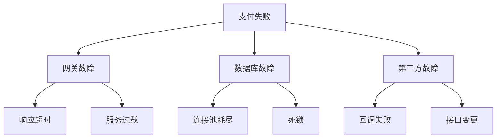

# FMEA 图经典案例：支付系统失效分析

## FMEA 分析表

| 组件 | 失效模式 | 失效影响 | 严重度(1-10) | 失效原因 | 发生度(1-10) | 检测方法 | 检测度(1-10) | RPN | 改进措施 |
|------|---------|---------|------------|---------|------------|---------|------------|-----|---------|
| 支付网关 | 响应超时 | 用户无法完成支付 | 8 | 网络拥堵、服务过载 | 6 | 超时监控告警 | 3 | 144 | 增加超时重试、负载均衡 |
| 数据库 | 连接池耗尽 | 所有交易失败 | 10 | 连接未释放、并发过高 | 4 | 连接数监控 | 2 | 80 | 优化连接管理、扩容 |
| 第三方支付 | 回调失败 | 订单状态不同步 | 7 | 网络故障、接口变更 | 5 | 回调日志检查 | 4 | 140 | 主动查询补偿机制 |
| 订单服务 | 库存扣减失败 | 超卖 | 9 | 并发竞争、事务失败 | 3 | 库存对账 | 5 | 135 | 分布式锁、预扣库存 |

**RPN（风险优先数）= 严重度 × 发生度 × 检测度**

## 配套故障树图

**说明**：FMEA 表格系统化分析失效模式，故障树图可视化失效传播路径。
