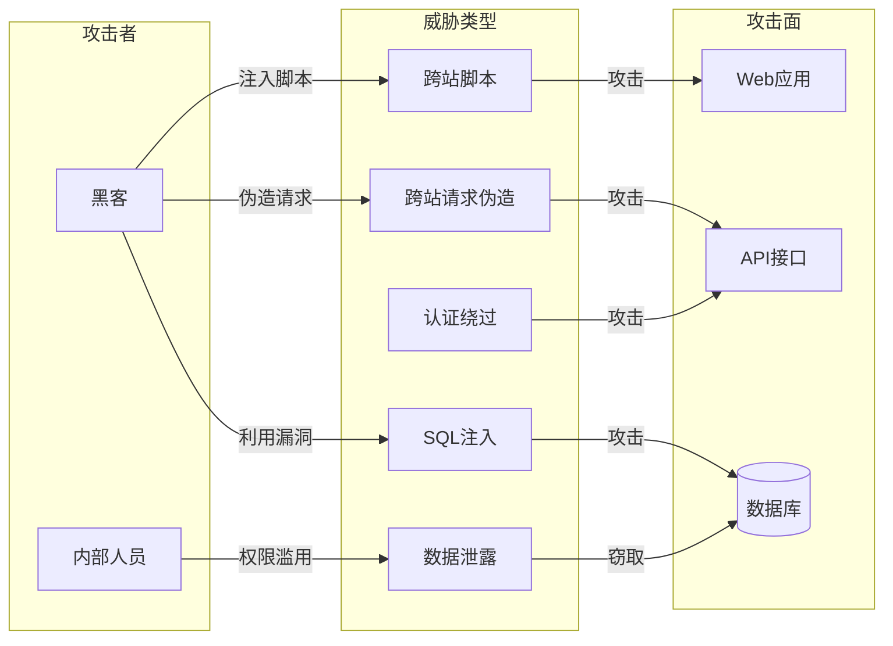

# 威胁模型图经典案例：Web 应用安全威胁分析

```mermaid
graph LR
    subgraph 攻击者
        Hacker[黑客]
        Insider[内部人员]
    end
    
    subgraph 攻击面
        WebApp[Web应用]
        API[API接口]
        DB[(数据库)]
    end
    
    subgraph 威胁类型
        SQLi[SQL注入]
        XSS[跨站脚本]
        CSRF[跨站请求伪造]
        AuthBypass[认证绕过]
        DataLeak[数据泄露]
    end
    
    Hacker -->|利用漏洞| SQLi
    Hacker -->|注入脚本| XSS
    Hacker -->|伪造请求| CSRF
    Insider -->|权限滥用| DataLeak
    
    SQLi -->|攻击| DB
    XSS -->|攻击| WebApp
    CSRF -->|攻击| API
    AuthBypass -->|攻击| API
    DataLeak -->|窃取| DB
```

**说明**：识别攻击者类型（外部/内部），列出攻击面和威胁类型，展示攻击路径和目标。
