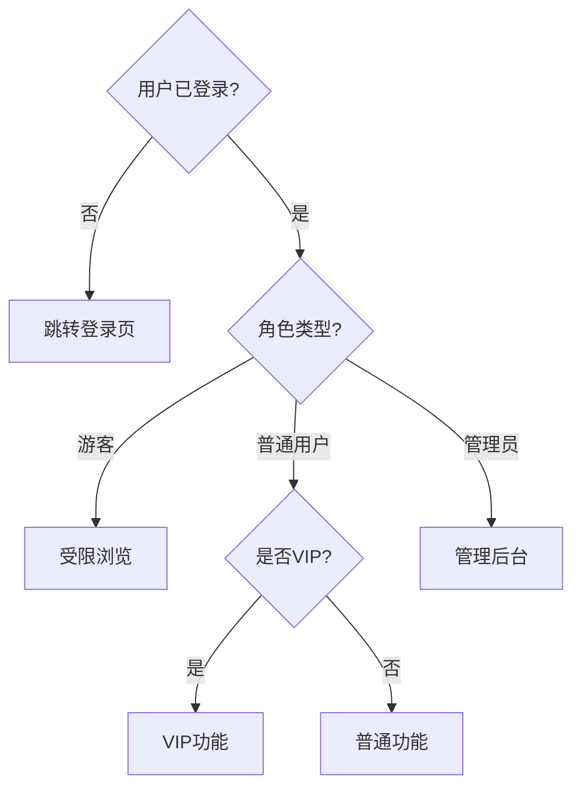

# 决策树经典案例：用户权限判断

```mermaid
graph TD
    Root{用户已登录?}
    
    Root -->|否| Login[跳转登录页]
    Root -->|是| CheckRole{角色类型?}
    
    CheckRole -->|游客| GuestView[受限浏览]
    CheckRole -->|普通用户| CheckVIP{是否VIP?}
    CheckRole -->|管理员| AdminPanel[管理后台]
    
    CheckVIP -->|是| VIPFeature[VIP功能]
    CheckVIP -->|否| NormalFeature[普通功能]
```

**说明**：多层级决策判断，展示登录状态、角色类型、VIP等级的决策路径。
