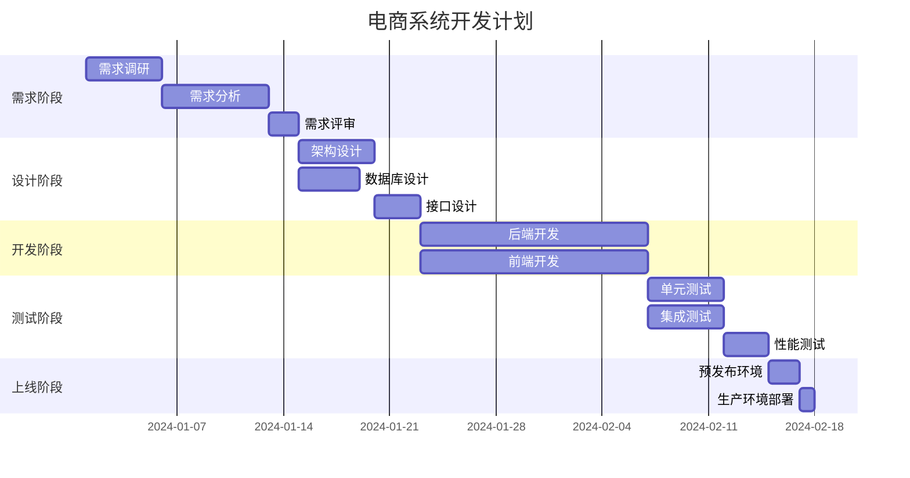

# 甘特图经典案例：项目开发排期

```mermaid
gantt
    title 电商系统开发计划
    dateFormat YYYY-MM-DD
    
    section 需求阶段
    需求调研        :a1, 2024-01-01, 5d
    需求分析        :a2, after a1, 7d
    需求评审        :a3, after a2, 2d
    
    section 设计阶段
    架构设计        :b1, after a3, 5d
    数据库设计      :b2, after a3, 4d
    接口设计        :b3, after b1, 3d
    
    section 开发阶段
    后端开发        :c1, after b3, 15d
    前端开发        :c2, after b3, 15d
    
    section 测试阶段
    单元测试        :d1, after c1, 5d
    集成测试        :d2, after c2, 5d
    性能测试        :d3, after d2, 3d
    
    section 上线阶段
    预发布环境      :e1, after d3, 2d
    生产环境部署    :e2, after e1, 1d
```

**说明**：按阶段分组任务，展示任务依赖关系（after），清晰呈现项目时间线。
