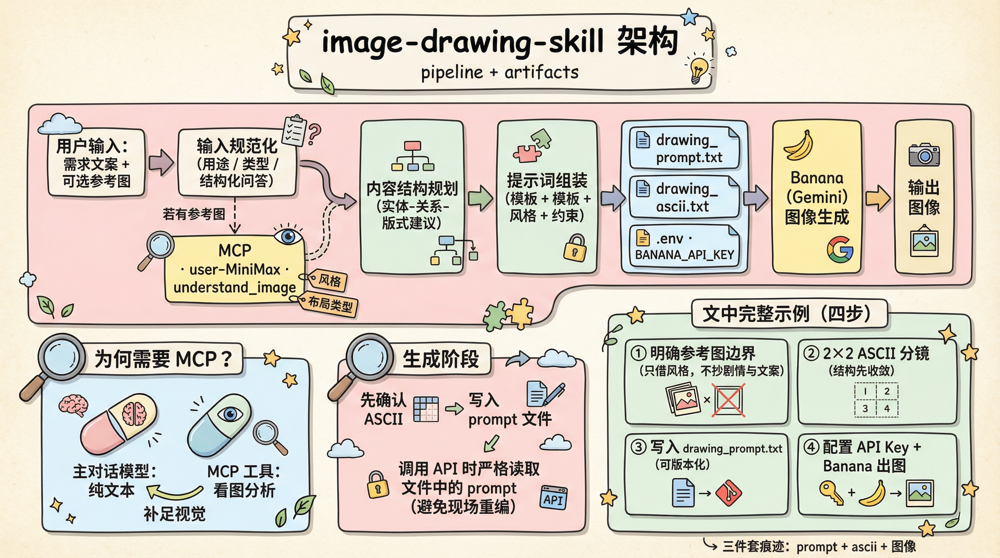
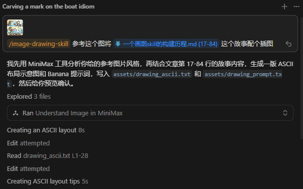
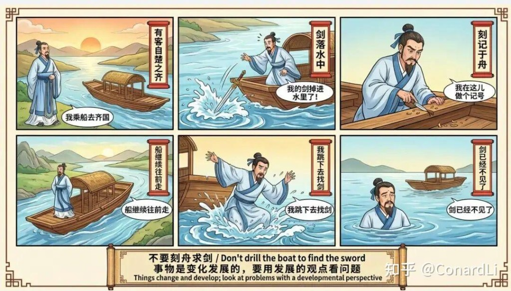
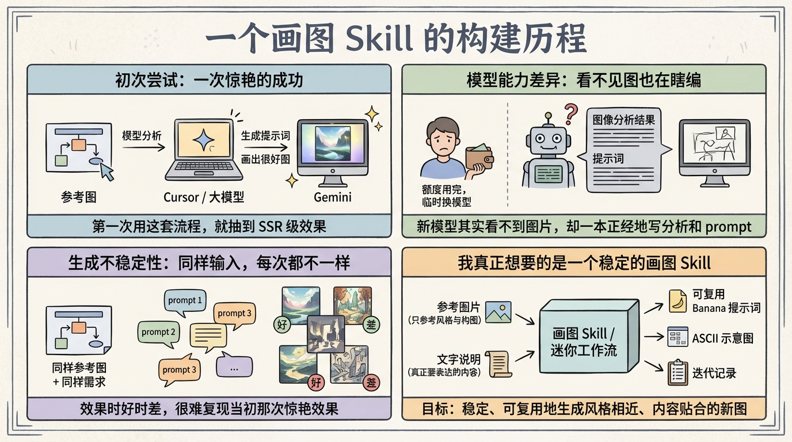

# 构建使用 Banana 画图 Skill 的一段历程

## 背景动机：从“随手试试”到“想要可控输出”

最近在写一些技术文档和分享材料，频繁需要插图。手动画图既耗时又难以保证风格统一，于是开始尝试用 AI 帮忙画图。

我听说用 Banana 进行图像生成的效果很惊艳，就想着：  
**“能不能用一套相对稳定的流程，让我在写文档时，随时把想法变成图？”**

我的工具链是：

- 编辑环境：Cursor
- 多模态与提示词生成：大模型（如 Gemini / MiniMax 等）
- 图像生成：Banana（通过 Gemini Banana 模型）

一开始只是抱着“试试看”的心态，没想到第一次就给了我非常惊艳的效果，这也直接把我带进了后面的“踩坑之旅”。

---

## 初次尝试：一次惊艳的成功

第一次尝试时，我做了这样一件事：

1. 找了一张论文里的示意图，直接扔给 Cursor。
2. 让模型帮我：
   - 分析这张图的内容和结构；
   - 概括图像的风格；
   - 生成一段适合作为 Banana 提示词（prompt）的描述。
3. 然后把这段提示词复制给 Gemini 进行画图。

结果非常惊艳：

- 新生成的图在风格上和原论文图非常接近；
- 结构也比较清晰，整体表达了类似的含义；
- 对文档排版来说，质感已经足够好。

这次体验非常好，以至于我下意识地以为：  
**“这套流程以后应该都可以这么用。”**

事实证明，这种“第一次就抽到 SSR”的体验，是后面一系列踩坑的开始。

---

## 踩坑经历：为什么后面再也画不出当初的效果？

过了几天，我想画更多的图，于是自然地复用了之前那套流程：

1. 仍然是给一张参考图；
2. 让 Cursor / 大模型分析图像、生成提示词；
3. 把提示词交给 Banana 画图。

这一次，效果却怎么都达不到第一次那种惊艳的程度，甚至有时完全跑偏。为了理解问题出在哪里，我开始一点点排查，发现了几个关键因素。

### 模型能力差异：多模态 vs 纯文本

有一次，由于 Cursor 的额度用完了，我临时切换成了 MiniMax 的模型。  
**坑点在这里：MiniMax 当时的这个模型其实不支持图片输入**，也就是说：

- 我虽然把参考图片“传”给了模型；
- 但模型根本“看不到”这张图；
- 它却一本正经地给我输出了“图像分析结果”和“提示词”。

从体验上看，模型还是会说得头头是道，很容易让人误以为它真的理解了图像内容。  
但实际上，整个链路已经变成了：**“在没有看图的前提下，瞎编 prompt”**。

这也解释了为什么后续生成的图经常和原图风格不搭、内容偏题。

### 生成不稳定性：每次提示词都不一样

即便在模型支持图片输入的情况下，还有另一个问题：

- **同样的参考图 + 同样的需求描述**；
- 模型每次生成的提示词都不一样；
- 即便你觉得“这次的提示词不错”，下次也很难完全复用。

结果就是：

- 画图效果高度依赖“这一次的提示词是否刚好写得好”；
- 很难复现某一幅“成功案例”的风格和构图逻辑。

对实际写文档的人来说，这种不确定性会非常折磨：  
你明明只是想“再画一张类似风格的图”，却总是在和随机性搏斗。

---

## 明确问题：我真正想解决的是什么？

在踩坑一段时间后，我开始重新梳理需求，发现自己真正要解决的问题是：

> **给定一张参考图片 + 一段画图需求（比如要说明的概念、流程或结构），如何稳定地生成一张风格相近、内容贴合的新图？**

这里包含几个关键信息：

- 输入：
  - 一张或者多张参考图片（用于风格与构图参考）；
  - 一段文字说明（这张新图要表达的内容是什么）。
- 输出：
  - 一个可复用、可调试的 Banana 提示词；
  - 一个 ASCII 文本示意图，帮助我快速理解“这段提示词大概会画出什么结构”；
  - 可选地，再加上多轮的迭代修改记录。

也就是说，我需要的是一个**“围绕画图场景的迷你工作流 / Skill”**，而不仅仅是“临时问一问大模型”。

---

## 解决思路：把画图流程封装成一个专门的 Skill

基于上述思考，我设计并实现了一个专门的“画图 Skill”。这个 Skill 的目标是：

- 尽量把“好图”的生成过程拆解为若干可控步骤；
- 把每一步里“人工试错的经验”沉淀进去；
- 最终沉淀出一套可复用、可迭代、可解释的画图流程。

整体流程可以概括为几步：

### 步骤 1：多模态分析参考图片

- 调用支持图片输入的多模态模型（这点非常关键）；
- 输入：一张或多张参考图片；
- 输出：
  - 图中的核心元素（例如：节点、箭头、分组区域等）；
  - 这些元素之间的关系（层级、指向、对比、并列等）；
  - 整体风格描述：
    - 比如是“极简扁平”、“类论文风格”、“手绘风”、“高对比线条图”等；
    - 颜色搭配、大致配色数量等；
  - 排版布局：
    - 图是横向流程、纵向层级、矩阵结构还是环形结构；
    - 文字与图形的比例，大标题/小标签的风格等。

这一部分的输出，相当于给图做了一份“结构化解构报告”。

### 步骤 2：分析目标文本内容，决定应该画什么

- 输入：我当前的画图需求文本，例如：
  - “我要画一张展示 A→B→C 的流水线图”；
  - “需要一张对比两种架构方案优缺点的示意图”；
  - “想画一张系统整体组件与数据流向的图”。
- 模型需要做的事：
  - 理解文本中的关键实体（组件、角色、模块、步骤等）；
  - 理解这些实体之间的关系类型（顺序、因果、包含、对比、依赖等）；
  - 根据内容特点，建议一个合理的构图方式（流程图、结构图、分层架构图、表格式对比图等）。

这一部分的产出决定了：  
**“我应该画一张什么结构的图，才能把这段文字讲清楚？”**

### 步骤 3：融合风格分析与内容结构，生成 Banana 提示词

在有了：

- 参考图片的风格/布局分析；
- 目标内容对应的构图方案；

之后，Skill 会让模型去生成一个面向 Banana 的提示词。这个提示词重点包括：

- 图像内容部分：
  - 明确有哪些核心元素；
  - 它们如何摆放、如何连线、如何分组；
  - 每个元素是否带文字标签。
- 风格控制部分：
  - 色彩风格（如“论文风的黑白灰 + 少量强调色”）；
  - 线条、阴影、圆角等图形细节；
  - 图像整体质感（简洁/工程化/卡通/草图风等）。
- 技术控制部分（如适用）：
  - 分辨率、纵横比；
  - 是否需要透明背景；
  - 是否要避免过多装饰元素等。

关键一点在于：  
**这段提示词会被完整地保存下来（例如保存在一个文本文件中），以后可以直接复用或在此基础上微调。**

### 步骤 4：生成 ASCII 文本示意图，帮助快速理解构图

光有一段文字提示词，往往很难直接想象出“图大概长什么样”。  
为此，Skill 会额外生成一个 ASCII 示意图，例如：

```text
+---------------------------+
|        系统入口          |
+---------------------------+
            |
            v
+---------------------------+
|       模块 A：预处理      |
+---------------------------+
            |
            v
+---------------------------+
|       模块 B：计算核心    |
+---------------------------+
            |
            v
+---------------------------+
|       模块 C：结果展示    |
+---------------------------+
```

这种文本示意图有几个好处：

- 能在几秒钟内理解构图的整体布局；
- 可以快速和自己心里的构想对比，发现“不对劲的地方”；
- 修改也非常方便：直接在文本里挪位置、改箭头、改名字即可。

实际上，ASCII 图在这个流程里起到了“低成本 prototype”的作用：  
先把结构定清楚，再让 Banana 去画“高质量版本”。

### 步骤 5：多轮反馈与迭代修改

真实使用中，几乎很难“一次生成就完美”。因此 Skill 里还有一个自然的环节：

- 先根据当前提示词 + ASCII 图画一版试图；
- 根据实际生成图存在的问题（例如：
  - 对齐不美观；
  - 文字太多/太少；
  - 重点不够突出；
  - 颜色不符合文档整体风格；
- 再反馈给模型，让其：
  - 调整提示词中的具体表述；
  - 或者调整 ASCII 图中的布局，重新生成提示词。

通过若干轮这样的“看图 → 调整 → 再生成”，可以最终得到一个：

- 在结构上更清晰；
- 在风格上更稳定；
- 可以被保存和复用的提示词。

---

## Skill 内部结构：与 `image-drawing-skill` 的对齐

前面从概念上讲了一套“画图工作流”，在真正落地时，我是直接把它落实到一个可复用的 Skill—— `image-drawing-skill` 。  

- **输入规范化（Input Normalization）** → Skill 里的「分析用户需求」「询问图片用途和类型」「收集关键信息」部分；
- **参考图分析模块（Reference Image Analyzer）** → Skill 里的「使用 MiniMax 提供的 MCP 工具 `understand_image` 对图片做分析」（MiniMax 当前主模型本身不支持多模态，所以通过 MCP 提供的专用图像分析工具来补足）、「根据图片类型选择提示词构建方式」、「风格元素提取」部分；
- **内容结构规划模块（Content Struct Planner）** → Skill 里针对不同图片类型（流程图/架构图/决策树等）的结构化问题清单和布局推荐；
- **提示词组装器（Prompt Assembler）** → Skill 里“生成提示词初稿”“选择模板”“根据风格+内容拼装 Banana 提示词”以及“检查/读取提示词文件”的那一整段逻辑；
- **反馈环与版本管理（Feedback & Versioning）** → Skill 中“展示 ASCII 布局预览”“让用户确认/修改/补充”“基于提示词文件迭代修改并重新生成”的闭环。

更具体一点，对照 `image-drawing-skill` 的实现，可以把内部结构理解为四个“核心存储+两个外部依赖”：

- 核心存储：
  - **提示词文件**：默认是 `assets/drawing_prompt.txt`，用于持久化当前版本的 Banana 提示词；
  - **ASCII 布局文件**：默认是 `assets/drawing_ascii.txt`，用于保存文本示意图；
  - **环境变量 / `.env` 文件**：用于存储 `BANANA_API_KEY` 等调用 Banana 所需的配置；
  - （可选）生成图片文件：例如 `assets/output.png` 或其他命名。
- 外部依赖：
  - **MiniMax 图像理解工具**：`user-MiniMax.understand_image`，负责从参考图中抽取风格与布局信息；
  - **Banana 图像生成 API**：通过 `BANANA_API_KEY` 调用 Gemini Banana Pro 生成最终图像。

这样设计的一个直接好处是：  
**每一次画图尝试，都会在文件系统里留下“提示词 + ASCII + 图片”的完整三件套痕迹**，有利于后续追踪、复用和对比不同版本。




---

## 一个完整使用示例：结合 `image-drawing-skill` 的实际流程

为了更具体一点，下面用我这次真实执行的任务做案例：  
**“参考一张漫画图的视觉风格，但内容严格按本文故事（初次惊艳成功 → 两个关键坑 → 形成稳定 Skill）来画一张配图。”**

### 场景描述（本次真实需求）

输入条件是：

- 我提供了一张参考图（用于借鉴风格）；
- 我指定了文章中的文本片段（本故事语义）作为内容来源。



目标是：

- 生成一张四格/多格信息漫画式插图；
- **只参考风格，不复用参考图剧情元素**；
- 输出落到项目文件里，便于复用与迭代。

### 第一步：先明确“参考图使用边界”

在这个案例里，最关键的不是“怎么画”，而是先把约束说清楚：

- 参考图只用于：线条、配色、分镜节奏、边框风格；
- 参考图禁止复用：人物设定、具体情节、文案内容；
- 新图内容只能来自我提供的文本叙事。

这一步直接避免了一个常见问题：模型会把“参考风格”误扩展为“参考剧情”，导致画面跑题。

### 第二步：将文本故事结构化为可绘制分镜

Skill 先把文本压缩为 4 个叙事模块，并映射到 2x2 面板布局：

1. 初次尝试：一次惊艳成功；
2. 模型能力差异：看不见图也在瞎编；
3. 生成不稳定性：同样输入每次不同；
4. 明确目标：构建稳定、可复用的画图 Skill。

为了让结构先收敛，Skill 同时输出 ASCII 草图并保存到 `assets/drawing_ascii.txt`，例如：

```text
┌───────────────┬───────────────┐
│ ① 惊艳成功     │ ② 能力差异坑   │
├───────────────┼───────────────┤
│ ③ 不稳定性坑   │ ④ 建立稳定Skill │
└───────────────┴───────────────┘
```

这一步的作用是：先确认“讲什么、怎么排”，再进入画图提示词阶段。

### 第三步：写入可复用提示词文件（而不是一次性对话 prompt）

结构确认后，Skill 生成并更新 `assets/drawing_prompt.txt`（以及一个更短的 `assets/drawing_prompt_short.txt` 用于快速出图）。

提示词里包含三层信息：

- 内容层：四个面板分别画什么、文字标签是什么；
- 风格层：参考图的线条与色调要求；
- 约束层：明确禁止参考图剧情元素（如船、剑、古人等）。

这样做的结果是：prompt 变成了可追踪、可版本化资产，而不是“对话里一闪而过”的临时文本。

### 第四步：准备环境并调用 Banana 生成

在这个案例中，实际执行时先遇到一个典型问题：缺少 `BANANA_API_KEY`。  
补齐方式是将 key 写入项目 `.env`，然后由脚本读取提示词文件发起生成。

执行逻辑对应为：

- 从 `.env` 读取 `BANANA_API_KEY`；
- 读取 `assets/drawing_prompt.txt` 或短提示词文件；
- 调用 Banana 生成并输出图片文件。

## 效果图

下面给出本次案例中的**参考图**与**生成结果**，便于对照：参考图只用于风格与版式启发，画面叙事与文案以本文故事为准。

**参考图**（知乎上浏览时保存，仅作风格参考；不复制图中具体人物、情节与文字）：



**生成效果图**（按 `image-drawing-skill` 流程产出提示词后，由 Banana 生成）：



---

## 使用中的经验教训与一些小建议

在多次使用和迭代过程中，也踩出了很多“小坑”，记录几个比较关键的经验：

- 一定要确认当前模型是否真的支持多模态输入。
- 尽量让“结构”先收敛，再去打磨“风格”。
- 保存提示词和生成结果的“配对关系”，而不是只保存图片。
- 对“随机性”保持一定的容忍度，但用版本管理和模板去驯服它。

---

## 如何用这个 skill？

当前 `image-drawing-skill` 里**参考图分析**这一步，是按「主对话模型可能看不见图」来设计的，因此默认会走 **MiniMax 的 MCP 工具**（`user-MiniMax` · `understand_image`）做视觉理解。要做到开箱可用，你需要：

1. **安装 Skill**（按 Cursor / 本机 skills 目录的惯例，把 `image-drawing-skill` 放到可被 Agent 读取的位置）。
2. **在 Cursor 里配置 MCP**：启用 **MiniMax** 对应的服务器，确保工具列表里能看到 **`understand_image`**，并且本机网络/鉴权（若服务端要求）可用；否则「有参考图」时分析步骤会失败或只能跳过。
3. **配置 Banana 出图**：在项目或用户目录准备 **`BANANA_API_KEY`**（常见做法是 `.env`），以便脚本或流程里调用 Gemini Banana Pro 生成图片。

若你实际使用的主模型**本身支持多模态**（对话里能稳定读图），可以**改一版 Skill 适配自己的环境**：把「调用 `understand_image`」换成「让当前多模态模型直接分析参考图」，输出仍建议保持同一套结构化字段（风格类型、布局、配色、装饰元素等），后面的「内容规划 → 写 ASCII → 写 `drawing_prompt.txt` → 读文件调用 Banana」可以不变。这样减少一层 MCP 依赖，但要自己确认**该模型不会在没有看图的情况下假装分析**（否则又会回到「瞎编风格」的坑）。

---

## 总结：从“撞大运”到“可复用的画图工作流”

回顾整个过程，其实就是从：

- 一次运气很好的一次性尝试，  
- 到意识到问题：不稳定、不可复现、模型能力不匹配，  
- 再到抽象出真正需求：参考图 + 内容 → 稳定生成同风格新图，  
- 最终逐步搭建了一个有结构的画图 Skill / 工作流。

现在，这个 Banana 画图 Skill 已经具备了几个核心能力：

- 能够看懂参考图，抽象出风格和布局；
- 能够理解我要讲的内容，提出合理的构图建议；
- 能把两者融合，生成可复用的 Banana 提示词；
- 能输出 ASCII 文本示意图，帮助我快速校对构图；
- 支持多轮迭代和两种实际画图方式（手动 & API）。


但至少现在，我已经从“碰运气画图”迈向了一个可理解、可控制、可复用的 Banana 画图工作流。


## Reference

1. https://zhuanlan.zhihu.com/p/1976271572919669857
2. 