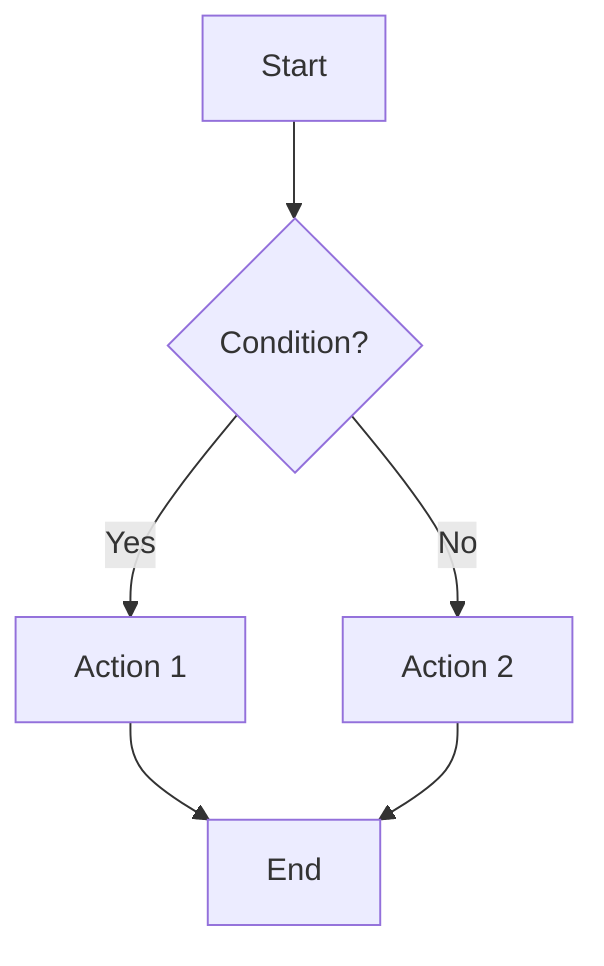
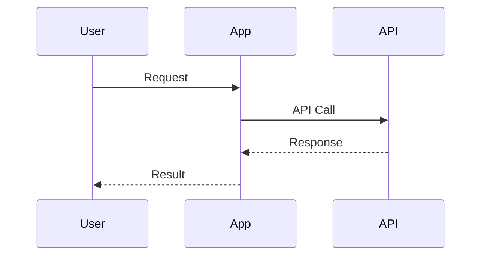
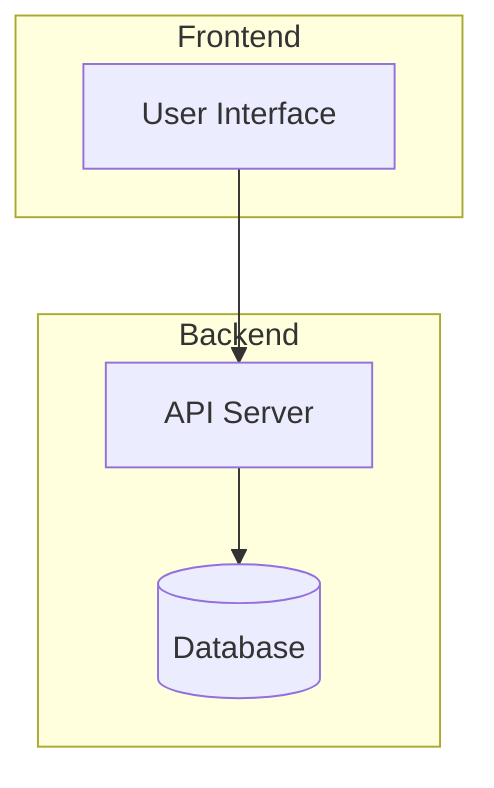

# Output Format Standards for WeChat Article Extractor

## Summary Format

### Standard Summary Template
```
📰 **Article Title**

**Core Summary** (100-150 words)
[Concise overview of main topic and key takeaways]

**Key Insights**
• [Key point 1]
• [Key point 2] 
• [Key point 3]

**Target Audience**
[Who would benefit from this article]

**Action Items**
• [Actionable step 1]
• [Actionable step 2]

**Source**: [Article URL]
```

### Summary Quality Checklist
- [ ] **Length**: 100-150 words for main summary
- [ ] **Clarity**: Clear and understandable language
- [ ] **Accuracy**: Faithful representation of original content
- [ ] **Key Points**: 3-5 main insights captured
- [ ] **No New Information**: Only includes content from article
- [ ] **Grammar**: Proper spelling and grammar

## Structured Data Format

### JSON Output Schema
```json
{
  "metadata": {
    "title": "Article Title",
    "url": "https://mp.weixin.qq.com/s/...",
    "extraction_timestamp": "2024-01-01T12:00:00Z",
    "extraction_time_seconds": 12.5,
    "word_count": 1500,
    "reading_time_minutes": 7
  },
  "content": {
    "full_text": "Complete article text...",
    "summary": "Condensed summary...",
    "key_points": [
      "Point 1",
      "Point 2",
      "Point 3"
    ]
  },
  "analysis": {
    "category": "technology|business|design|other",
    "technical_level": "beginner|intermediate|advanced",
    "has_code_samples": true,
    "has_visualizations": false,
    "topics": ["topic1", "topic2"]
  },
  "visualizations": [
    {
      "type": "flowchart|sequence|architecture",
      "title": "Diagram Title",
      "mermaid_code": "mermaid code here"
    }
  ]
}
```

### Category Classification
```python
CATEGORY_MAPPING = {
    'technology': ['编程', '开发', '技术', '代码', 'API', '架构'],
    'business': ['商业', '运营', '市场', '产品', '管理'],
    'design': ['设计', 'UI', 'UX', '视觉', '交互'],
    'data': ['数据', '分析', '算法', '机器学习', 'AI']
}
```

## Technical Content Format

### Code Block Standards
```python
# Code extraction and formatting
def format_code_block(code: str, language: str) -> dict:
    """
    Format extracted code with metadata
    """
    return {
        'language': language,
        'code': code.strip(),
        'line_count': len(code.split('\n')),
        'formatted': f"```{language}\n{code}\n```"
    }
```

### API Documentation Format
```yaml
# API endpoint extraction
api_documentation:
  title: "API Guide Title"
  version: "1.0"
  endpoints:
    - method: "GET"
      path: "/api/resource/{id}"
      description: "Get resource by ID"
      parameters:
        - name: "id"
          type: "string"
          required: true
          location: "path"
      authentication:
        type: "Bearer Token"
        required: true
```

## Visualization Standards

### Mermaid Diagram Conventions

#### Flowcharts


#### Sequence Diagrams


#### Architecture Diagrams


### Visualization Quality Checklist
- [ ] **Readability**: Clear text and labels
- [ ] **Accuracy**: Correct representation of concepts
- [ ] **Completeness**: All components included
- [ ] **Consistency**: Uniform styling and notation
- [ ] **Render Test**: Verified to render correctly

## Report Format

### Comprehensive Report Template
```
# WeChat Article Analysis Report

## Executive Summary
[High-level overview]

## Article Details
- **Title**: [Article Title]
- **URL**: [Article URL]
- **Word Count**: [Number]
- **Reading Time**: [Minutes]
- **Technical Level**: [Beginner/Intermediate/Advanced]

## Main Content
### Key Concepts
[Detailed concept explanations]

### Technical Details
[Code samples, configurations, etc.]

### Implementation Steps
[Step-by-step instructions if applicable]

## Analysis
### Strengths
- [Strength 1]
- [Strength 2]

### Limitations
- [Limitation 1]
- [Limitation 2]

### Recommendations
- [Recommendation 1]
- [Recommendation 2]

## Visualizations
[Embedded diagrams and charts]

## References
- Original Article: [URL]
- Related Resources: [Links]
```

## Format Selection Logic

### Auto-Detection Rules
```python
def select_output_format(article_content: str, user_request: str) -> str:
    """
    Automatically select appropriate output format based on content and request
    """
    # Check user preference
    if "summary" in user_request.lower():
        return "summary"
    elif "detailed" in user_request.lower():
        return "report"
    elif "api" in user_request.lower():
        return "api_docs"
    
    # Analyze content
    if contains_technical_content(article_content):
        if has_architecture_descriptions(article_content):
            return "architecture_report"
        elif has_api_descriptions(article_content):
            return "api_docs"
        else:
            return "technical_summary"
    
    return "summary"  # Default
```

### Content Analysis Functions
```python
def contains_technical_content(text: str) -> bool:
    """Detect technical content indicators"""
    tech_indicators = [
        '代码', '编程', '开发', 'API', '函数', '类',
        '架构', '部署', '配置', '数据库', '服务器'
    ]
    return any(indicator in text for indicator in tech_indicators)

def has_architecture_descriptions(text: str) -> bool:
    """Detect architecture-related content"""
    arch_indicators = [
        '架构', '组件', '模块', '服务', '系统',
        '部署', '集群', '分布式', '微服务'
    ]
    return any(indicator in text for indicator in arch_indicators)

def has_api_descriptions(text: str) -> bool:
    """Detect API-related content"""
    api_indicators = [
        'API', '接口', '端点', 'REST', '请求',
        '响应', '参数', '认证', 'HTTP'
    ]
    return any(indicator in text for indicator in api_indicators)
```

## Localization Support

### Multi-language Output
```python
OUTPUT_LANGUAGES = {
    'zh': {
        'summary_label': '摘要',
        'key_points': '要点',
        'reading_time': '阅读时间',
        'source': '来源'
    },
    'en': {
        'summary_label': 'Summary',
        'key_points': 'Key Points',
        'reading_time': 'Reading Time',
        'source': 'Source'
    }
}
```

### Language Detection
```python
def detect_article_language(text: str) -> str:
    """
    Detect article language for appropriate output formatting
    """
    chinese_chars = len([c for c in text if '\u4e00' <= c <= '\u9fff'])
    total_chars = len(text)
    
    if chinese_chars / total_chars > 0.5:
        return 'zh'
    else:
        return 'en'
```

## Validation and Quality Assurance

### Output Validation
```python
def validate_output_format(output: str, format_type: str) -> bool:
    """
    Validate output meets format requirements
    """
    if format_type == "summary":
        return 100 <= len(output) <= 2000
    elif format_type == "json":
        try:
            import json
            json.loads(output)
            return True
        except:
            return False
    return True
```

### Quality Metrics
- **Completeness**: All required sections present
- **Accuracy**: Faithful to original content
- **Readability**: Clear and well-structured
- **Consistency**: Uniform formatting throughout
- **Timeliness**: Generated within reasonable time