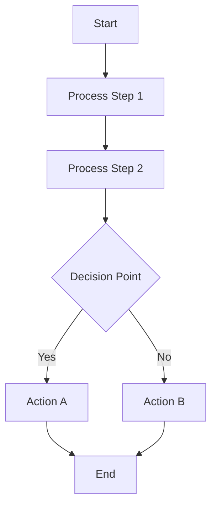
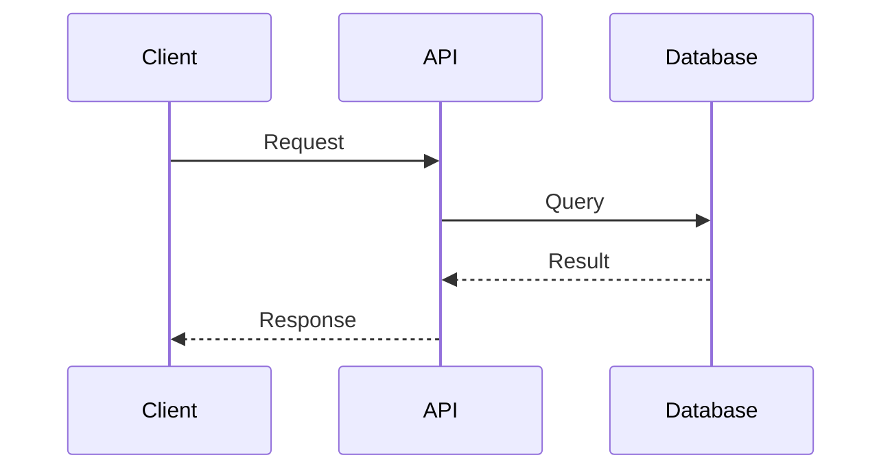
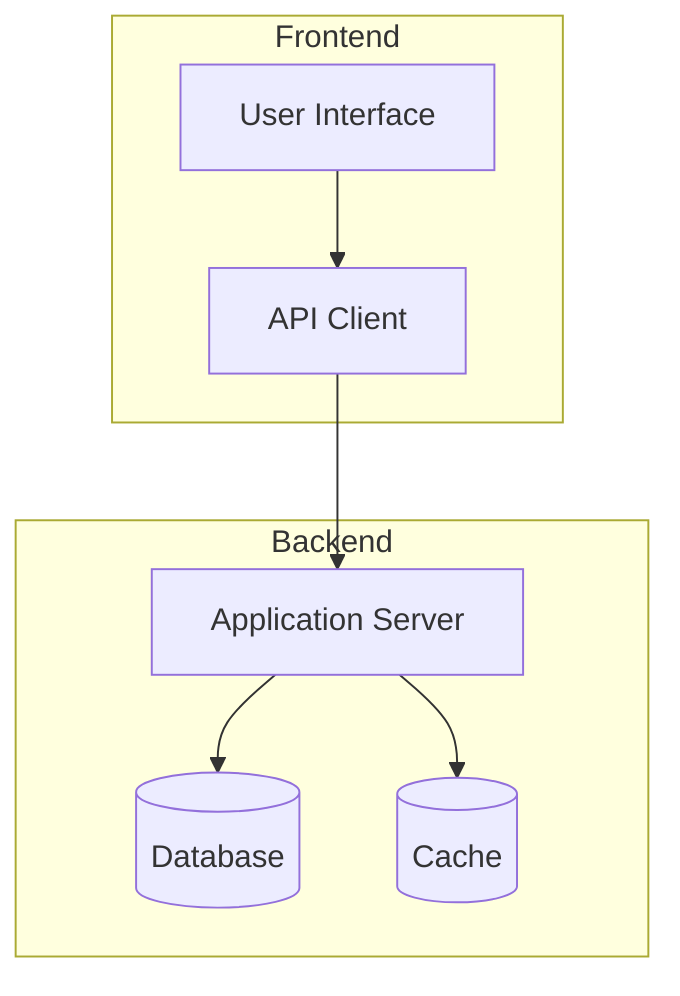

# Technical Guide for WeChat Article Extraction

## Architecture Diagram Generation

### When to Generate Diagrams
Automatically create visualizations for articles containing:
- System architecture descriptions
- Process workflows
- API integration sequences
- Data processing pipelines
- Development methodologies
- Deployment procedures

### Supported Diagram Types

#### Flowcharts for Processes


#### Sequence Diagrams for APIs


#### Architecture Diagrams


## Code Extraction Standards

### Code Block Detection
- Identify code snippets in articles
- Preserve original formatting and indentation
- Detect programming language from context
- Extract code blocks with syntax highlighting hints

### Code Processing
```python
# Example: Code extraction pattern
def extract_code_blocks(article_content: str) -> List[Dict]:
    """
    Extract and categorize code blocks from article content
    """
    code_patterns = [
        r'```(\w+)\n(.*?)\n```',  # Markdown code blocks
        r'<code[^>]*>(.*?)</code>',  # HTML code tags
        r'(?:\n    .+)+\n',  # Indented code blocks
    ]
    
    extracted_blocks = []
    for pattern in code_patterns:
        matches = re.findall(pattern, article_content, re.DOTALL)
        for match in matches:
            language = match[0] if len(match) > 1 else 'text'
            code = match[-1]
            extracted_blocks.append({
                'language': language,
                'code': code.strip(),
                'lines': len(code.split('\n'))
            })
    
    return extracted_blocks
```

## API Documentation Processing

### Endpoint Extraction
For articles describing APIs, automatically extract:
- **HTTP Method**: GET, POST, PUT, DELETE
- **Endpoint Path**: URL patterns with parameters
- **Request Parameters**: Query, path, and body parameters
- **Response Format**: JSON/XML schemas
- **Authentication**: Auth methods and requirements

### Example API Documentation Structure
```yaml
api_endpoints:
  - method: GET
    path: /api/v1/users/{userId}
    description: Retrieve user information
    parameters:
      - name: userId
        type: string
        required: true
        location: path
    responses:
      200:
        description: Success
        schema:
          type: object
          properties:
            id:
              type: string
            name:
              type: string
```

## Development Workflow Automation

### CI/CD Pipeline Extraction
Identify and document:
- Build processes
- Testing procedures
- Deployment steps
- Environment configurations
- Dependencies and prerequisites

### Workflow File Generation
Create executable workflow files in the project-approved `{workflow_artifact_root}` directory:
```python
# Example workflow structure
workflow:
  name: "Article Processing Pipeline"
  steps:
    - name: "Content Validation"
      action: "validate_url"
      params:
        url: "{{article_url}}"
    
    - name: "Content Extraction"
      action: "extract_article"
      depends_on: ["Content Validation"]
    
    - name: "Technical Analysis"
      action: "analyze_technical_content"
      depends_on: ["Content Extraction"]
    
    - name: "Visualization Generation"
      action: "create_diagrams"
      depends_on: ["Technical Analysis"]
```

## Content Quality Standards

### Article Assessment Criteria
- **Technical Depth**: Presence of code, APIs, architecture details
- **Process Complexity**: Multi-step procedures or workflows
- **Visualization Potential**: Content suitable for diagrams
- **Actionable Content**: Specific instructions or implementations

### Quality Checklists

#### Technical Content Checklist
- [ ] Code blocks properly formatted
- [ ] API endpoints documented
- [ ] Architecture descriptions clear
- [ ] Dependencies identified
- [ ] Version requirements specified

#### Visualization Checklist
- [ ] Diagram type appropriate for content
- [ ] All components labeled
- [ ] Flow direction clear
- [ ] Legend provided if needed
- [ ] Diagram renders correctly

## Integration Points

### External Tools
- **Mermaid**: Diagram generation
- **Playwright**: Browser automation
- **Pandoc**: Document conversion (if needed)
- **GitHub**: Workflow file storage

### Data Flow
1. Input: WeChat article URL
2. Processing: Content extraction and analysis
3. Output: Structured data + visualizations
4. Storage: Generated files in project structure
5. Integration: Workflow automation triggers
