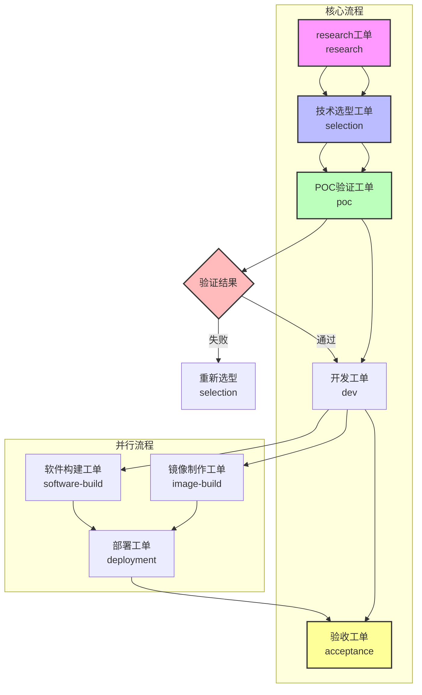

# 工单流转关系图

## 📊 工单流转决策图



## 流转关系矩阵

| 当前工单 | 可能的上游 | 可能的下游 | 流转条件 |
|---------|-----------|-----------|---------|
| research | 无 | selection | 技术洞察完成 |
| selection | research | poc | 技术方案确定 |
| poc | selection | dev | 验证通过 |
| dev | poc | software-build, acceptance | 开发完成 |
| software-build | dev | deployment | 构建成功 |
| deployment | software-build, image-build | acceptance | 部署成功 |
| acceptance | deployment | 无 | 验收通过 |
| image-build | selection | deployment | 镜像构建成功 |

## 并行流转场景

### 场景1: 标准开发流程
```
research → selection → poc → dev → software-build → deployment → acceptance
```

### 场景2: 容器化部署流程
```
research → selection → poc → image-build → deployment → acceptance
```

### 场景3: 质量保障流程
```
research → selection → poc → dev → acceptance
                                          ↓
                                  software-build → deployment → acceptance
```

### 场景4: 快速原型流程
```
selection → poc → acceptance
```

### 场景5: 技术调研流程
```
research → selection
```

### 场景6: 简化验证流程
```
selection → poc → dev → acceptance
```

## 工单状态流转

### 状态定义
- **待开始**: 工单创建，等待执行
- **进行中**: 正在执行任务
- **阻塞**: 等待上游工单或外部依赖
- **已完成**: 所有任务完成
- **已归档**: 工单归档保存
- **已废弃**: 工单被取消或不再需要

### 状态流转规则
```
待开始 → 进行中 → 已完成 → 已归档
    ↓        ↓         ↓
   阻塞 ← ────┘         ↓
    ↓                  ↓
  已废弃 ← ──────────┘
```

## 占位符变量流转

### 通用变量
- `{{creation_time}}` - 工单创建时间
- `{{last_updated}}` - 最后更新时间
- `{{execute_name}}` - 工单执行标题
- `{{ticket_type}}` - 工单类型
- `{{status}}` - 工单状态

### 流转变量
- `{{input_ticket_id}}` - 上游工单ID
- `{{output_ticket_id}}` - 下游工单ID
- `{{related_ticket_ids}}` - 相关工单ID列表

### 工单特定变量
- `{{software_name}}` - 软件名称（software-build/deployment）
- `{{build_target}}` - 构建目标平台
- `{{language_type}}` - 编程语言类型
- `{{deploy_env}}` - 部署环境
- `{{image_tag}}` - 镜像标签（image-build）

### 示例流转
```
research: {{output_ticket_id}} = selection-001
技术选型: {{input_ticket_id}} = research-001, {{output_ticket_id}} = poc-001
POC工单: {{input_ticket_id}} = selection-001, {{output_ticket_id}} = dev-001
开发工单: {{input_ticket_id}} = poc-001, {{output_ticket_id}} = software_build-001
软件构建: {{input_ticket_id}} = dev-001, {{output_ticket_id}} = deployment-001  
部署工单: {{input_ticket_id}} = software_build-001, {{output_ticket_id}} = acceptance-001
```

## 最佳实践

### 1. 工单创建原则
- 每个工单专注于单一目标，避免功能重叠
- 明确上下游关系，确保流转顺畅
- 合理设置触发条件，避免过早或过晚触发
- 使用标准命名规范：`类型-序号-简短描述`

### 2. 流转管理原则  
- 上游工单完成后再启动下游，确保依赖完整
- 及时更新工单状态，保持信息同步
- 保持占位符变量一致性，确保信息传递准确
- 建立工单依赖图，可视化流转关系

### 3. 质量保证原则
- 关键节点设置验收标准，确保交付质量
- 建立完整的文档链，确保知识传承
- 定期回顾工单流转效率，持续优化流程

### 4. 技能集成原则
- 根据工单类型匹配合适的核心技能
- 确保技能依赖正确配置和可用
- 建立技能执行标准，保证结果一致性
- 监控技能执行性能，及时发现和解决问题

## 故障处理

### 常见流转问题
1. **上游未完成**: 等待上游工单完成，或检查上游阻塞原因
2. **输出不完整**: 补充缺失的输出内容，确保下游依赖完整
3. **技能不可用**: 检查技能配置和依赖，确保环境正常
4. **占位符变量缺失**: 检查变量定义和传递，确保信息完整
5. **流转条件不满足**: 检查触发条件，确保满足流转要求

### 诊断工具
- `ticket-cli progress` - 检查工单进度和状态
- `ticket-cli validate` - 验证工单结构和完整性
- `ticket-cli trace` - 查看执行跟踪日志
- `ticket-cli deps` - 分析工单依赖关系

### 解决方案
1. **状态异常**: 使用 `ticket-cli status` 查看详细状态
2. **依赖问题**: 使用 `ticket-cli deps` 分析依赖链
3. **执行失败**: 查看 `trace.md` 定位具体问题
4. **性能问题**: 检查技能执行时间和资源使用
5. **配置问题**: 验证技能配置和环境变量

### 预防措施
- 建立工单模板验证机制
- 实施自动化状态检查
- 定期审查流转效率
- 建立技能健康监控

---

*文档版本: v3.3 (移除ops工单，与模板库对齐)*
*更新时间: 2026-04-01*
*维护者: ticket-management技能*

## 变更日志

### v3.3 (2026-04-01)
- ✨ 移除ops工单相关内容，与模板库保持一致
- ✨ 调整流转链：部署工单直接到验收工单
- ✨ 更新决策图和流转场景

### v3.2 (2026-04-01)
- ✨ 添加Mermaid决策图到工单流转文档

### v3.1 (2026-04-01)
- ✨ 优化POC工单位置，确保概念验证在开发前完成
- ✨ 调整技术选型到POC的流转关系
- ✨ 完善POC工单输出内容，增加风险评估
- ✨ 更新流转场景，突出POC验证的重要性

### v3.0 (2026-04-01)
- ✨ 调整research工单为起始节点
- ✨ 完善各工单上下游关系
- ✨ 增加工单状态流转规则
- ✨ 扩展占位符变量体系
- ✨ 优化最佳实践指南
- ✨ 完善故障处理机制

### v2.0 (2026-04-01)
- ✨ 新增software-build工单
- ✨ 建立完整的CI/CD流转链
- ✨ 定义工单流转矩阵

### v1.0 (2026-03-30)
- 🎉 初始版本发布
- 🎉 定义基础工单类型
- 🎉 建立流转关系图